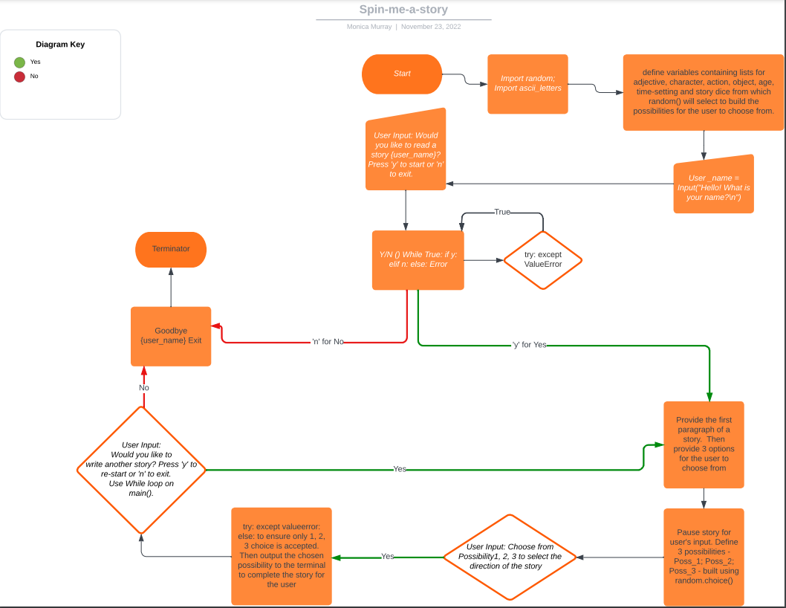

# Spin-me-a-Story

Spin-me-a-Story is a Python terminal, interactive short-story generator aimed at 'early readers' - the 6-10 age-group - which runs in the Code Institute mock terminal on Heroku.

Users can choose the direction their bespoke story takes, see character names they may recognise, and choose to read additional short-stories after the first ends.

## Features

A user's input is required to commence the game.  The user is asked "What is your name?".  The user's name must be alphabetic and input cannot be bipassed with a space or the enter key.

The user is asked if they would like to read a story.  The text input response is limited to 'y' for Yes, or 'n' for No.  

If the user chooses 'n', the message "Goodbye, {username}." prints to the terminal and the application ends.  

If the user chooses 'y', the first line of a random short-story prints to the terminal, followed by an invitation to choose from three options to continue the short-story - the input from the user is limited to the integers 1, 2 or 3.  

On making a selection, the remainder of the short-story prints to the terminal.

A final choice is offered to the user, with a 'y'/'n' input, to read another story or not.  If the user elects option 'y' for Yes, a loop begins and a new random short-story is generated and printed to a cleared screen.  If the user's choice is 'n' for No, the terminal message reads "Goodbye, {username}." and the application ends.

User input is limited to only the options provided in the terminal, and error messages are printed to prompt the user as to what input will be accepted if an input error is made.

On commencement of the story, and each additional story, the terminal is cleared of previous user prompts and input for a less cluttered user experience.

## Logic chart

Before beginning to write the code for this project, I used a pencil and paper to draw out a path that a story would follow.  That initial path took some turns and dead-end forks.  I used Lucid Chart to build a flow-chart as to the logical steps the application's code would need to take, which is diagramatically easy to follow and which provided some text reminders as to what my next steps should be during the coding process.

## Credits

When I decided to create a story generator based on my daughter's favourite activity, being told a random made-up story, I turned to Google to find out which other genius had worked on this before me.  And I found [this](https://towardsdatascience.com/fantasy-story-prompt-generator-2f56bf98dbfa) on www.towardsdatascience.com!

I needed to force an exit from the program when the user chose option 'n' when asked "Would you like to write a story, {username}?".  I Googled to find a suitable option and found [this](https://www.askpython.com/python/examples/exit-a-python-program ) and chose to import sys and use the sys.exit() method.

Writing a short story while writing and escaping while loops takes alot of time, so I got some inspiration on this book site to help me speed up the non-code aspect of my story generation project.  Please follow this [link](https://www.bookbrowse.com/excerpts/index.cfm/book_number/452/harry-potter-and-the-sorcerers-stone) to view the website.

W3Schools came up first in my Google results when I searched how to center text on the terminal, please view the link to that code [here](https://www.w3schools.com/python/trypython.asp?filename=demo_ref_string_center).

There's alot happening on the terminal in this short-story generator.  To minimise distraction I wanted to clear the screen for the user on running the application.  To do this, I've used the import os function which I found here on [Stack Overflow](https://stackoverflow.com/questions/2084508/clear-terminal-in-python) and which is effective.  I use it on first running the application, and again at the beginning of the loop to start a new short-story.

The CI linter returned a problem with the length of the f strings in my code.  These f strings are several random.choice() options returned to the user and are the basis of the randomised short-story lines so could not be recoded.  It took many searches and trials of suggested line continuation options, before I found the following entry on Stack Overflow which is *specific* to line continuation in f strings, and which suggests ending the first line of the f string with a closing quotation and enclosing each subsequent continuation line in it's own f string.  This works - it does not throw an error and, crucially, does not change the function of the code.  Thanks again to [Stack Overflow](https://stackoverflow.com/questions/45965007/multiline-f-string-in-python)!

Welcome Monica Murray,

This is the Code Institute student template for deploying your third portfolio project, the Python command-line project. The last update to this file was: **August 17, 2021**

## Reminders

* Your code must be placed in the `run.py` file
* Your dependencies must be placed in the `requirements.txt` file
* Do not edit any of the other files or your code may not deploy properly

## Creating the Heroku app

When you create the app, you will need to add two buildpacks from the _Settings_ tab. The ordering is as follows:

1. `heroku/python`
2. `heroku/nodejs`

You must then create a _Config Var_ called `PORT`. Set this to `8000`

If you have credentials, such as in the Love Sandwiches project, you must create another _Config Var_ called `CREDS` and paste the JSON into the value field.

Connect your GitHub repository and deploy as normal.

## Constraints

The deployment terminal is set to 80 columns by 24 rows. That means that each line of text needs to be 80 characters or less otherwise it will be wrapped onto a second line.

-----
Happy coding!