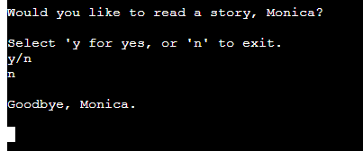
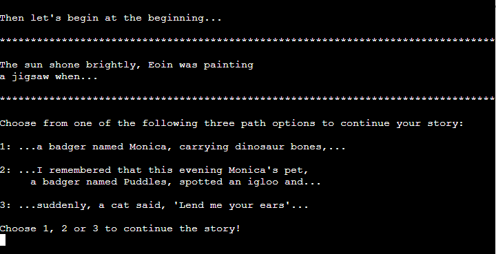

# Spin-me-a-Story

Spin-me-a-Story is a Python terminal, interactive short-story generator aimed at 'early readers' - the 6-10 age-group - which runs in the Code Institute mock terminal on Heroku.

Users can choose the direction their bespoke story takes, see character names they may recognise, and choose to generate and read additional short-stories after the first ends.

## Features

A user's input is required to commence the game.  The user is asked "What is your name?".  The user's name must be alphabetic and input cannot be bipassed with a space or the enter key.  An error message will display if user enters anything other than upper or lower case letters.

The user is asked if they would like to read a story.  The text input response is limited to 'y' for Yes, or 'n' for No.  

If the user chooses 'n', the message "Goodbye, {username}." prints to the terminal and the application ends.  

If the user chooses 'y', the first line of a random short-story prints to a cleared terminal, followed by an invitation to choose from three options to continue the short-story - the input from the user is limited to the integers 1, 2 or 3.  

On making a selection, the remainder of the short-story prints to the terminal.

A final choice is offered to the user, with a 'y'/'n' input, to read another story or not.  If the user elects option 'y' for Yes, a loop begins and a new random short-story is generated and printed to a cleared screen.  If the user's choice is 'n' for No, the terminal message reads "Goodbye, {username}." and the application ends.

User input is limited to only the options provided in the terminal, and error messages are printed to prompt the user as to what input will be accepted if an input error is made.

On commencement of the story, and each additional story, the terminal is cleared of previous user prompts and input for a less cluttered user experience.

## Logic chart

Before beginning to write the code for this project, I used a pencil and paper to draw out a path that a story would follow.  I then used Lucid Chart to build a flow-chart as to the logical steps the application's code would need to take, and how loops would work, which is diagramatically easy to follow and which provided some text reminders as to what my next steps should be during the coding process.

## Credits

When I decided to create a story generator based on my daughter's favourite activity, being told a random made-up story, I turned to Google to find out which other genius had worked on this before me.  And I found [this](https://towardsdatascience.com/fantasy-story-prompt-generator-2f56bf98dbfa) on www.towardsdatascience.com!  It helped me form a logical step-plan to code the application.

I needed to force an exit from the program when the user chose option 'n' when asked "Would you like to write a story, {username}?".  I Googled to find a suitable option and found [this](https://www.askpython.com/python/examples/exit-a-python-program ) and chose to import sys and use the sys.exit() method.

Writing a short story while writing and escaping while loops takes alot of time, so I got some inspiration on this book site to help me speed up the non-code aspect of my story generation project.  Please follow this [link](https://www.bookbrowse.com/excerpts/index.cfm/book_number/452/harry-potter-and-the-sorcerers-stone) to view the website.

W3Schools gave the best guidance when I searched how to center text on the terminal, please view the link to that code [here](https://www.w3schools.com/python/trypython.asp?filename=demo_ref_string_center).

I also took guidance from W3Schools when limiting my user's input of their user name to alphabet only and opted to use the isalpha() method from [here](https://www.w3schools.com/python/ref_string_isalpha.asp) as it was the most appropriate to this application.

There is alot of text being generated on the terminal in this short-story generator.  To minimise distraction I wanted to clear the screen for the user on running the application.  To do this, I've used the import os function which I found here on [Stack Overflow](https://stackoverflow.com/questions/2084508/clear-terminal-in-python) and which is effective.  I use it on first running the application, and again at the beginning of the loop to start a new short-story.

The CI linter returned a problem with the length of the f strings in my code.  These f strings are several random.choice() options returned to the user and are the basis of the randomised short-story lines so could not be recoded.  It took many searches and trials of suggested line continuation options, before I found the following entry on Stack Overflow which is *specific* to line continuation in f strings, and which suggests ending the first line of the f string with a closing quotation and enclosing each subsequent continuation line in it's own f string and because the whole f string code is enclosed in parenthesis, each line continuation is concatenated.  This works - it does not throw an error and, crucially, does not change the function of the code.  Thanks again to [Stack Overflow](https://stackoverflow.com/questions/45965007/multiline-f-string-in-python)!

To enable the user to read the story elements, I introduced a slight delay in printing the instructions by importing the time module and using its sleep function.  I had found [this code](https://stackoverflow.com/questions/17432478/python-print-to-one-line-with-time-delay-between-prints) on stack overflow and found it a simple but effective inclusion to my application.  

## Deployment

This application is deployed to, and runs on, Heroku.

### The following are the deployment steps I followed:

 - Ensure all changes were commited to GitHub;
 - Login to Heroku;
 
 #### On the Heroku dashboard:

 - Select the 'Create New App' button;
 - Choose and enter an application name for the new application in the text box provided, and select my region from the drop list ie. Europe, then click 'Create';
 
 #### Next, move to the Heroku Settings tab by clicking on 'Settings' at the top of the dashboard - see screenshot below:

 

 - Select the 'Reveal Config Var' button in the 'Config Vars' section of this screen - see screenshot below;

 

 - In the 'Key' field type "PORT", in the 'Value' field type "8000" - see screenshot below;

 

 - Click on the 'Add' button to add this credential to the deployed application;
 - Move down the screen slightly to the 'Buildpack' section of this screen: 
 - Select 'Add Buildpack' button - see screenshot below;

 

 - First select 'Python' from the pop-up screen, and click 'Save Changes' button to include this buildpack in the application - this pop-up screen closes automatically;
 - Again, select 'Add Buildpack' button;
 - Now select 'Nodejs' from the pop-up screen, and click on 'Save Changes' button to also include this buildpack in the application;
 
 #### Move to the Heroku Deploy tab by clicking on 'Deploy' at the top of the dashboard - see screenshot below:

 

 - In the 'Deployment Method' section of this tab, click on the GitHub button to 'connect to Github';
 - Search for my GitHub repository name by typing it, **exactly** as it appears in GitHub, in the searchbar, and click on 'Search';
 - Click on 'connect' to link up to my own GitHub repository code - see screenshot below;

 

 - Scroll down the page and in the 'Manual Deploy' section ensure the drop-down is set to 'Main', then click on 'Deploy branch' button to deploy the application - see screenshot below:

 

 - When this process has completed the text "Your app was successfully deployed" and a button 'View' appears - see screenshot below;  

 

 - Click this 'View' button to open a seperate terminal in which the application will run - see screenshot below.

 

 ### Deployment complete!

## Testing

I used the Code Institute linter to check my code was complying with PEP8 style guide.  Where errors arose with whitespace, line length, or indentation, I fixed them firstly in the linter to ensure the error would be resolved, and then in the Gitpod code:

Confirmation of 'All-clear' on the CI Linter is below:

I tested each new addition or change to my code as I worked, whether that was in a function or loop or importing libraries.  

Following deployment, I tested that the application runs as expected in the Python terminal. 

